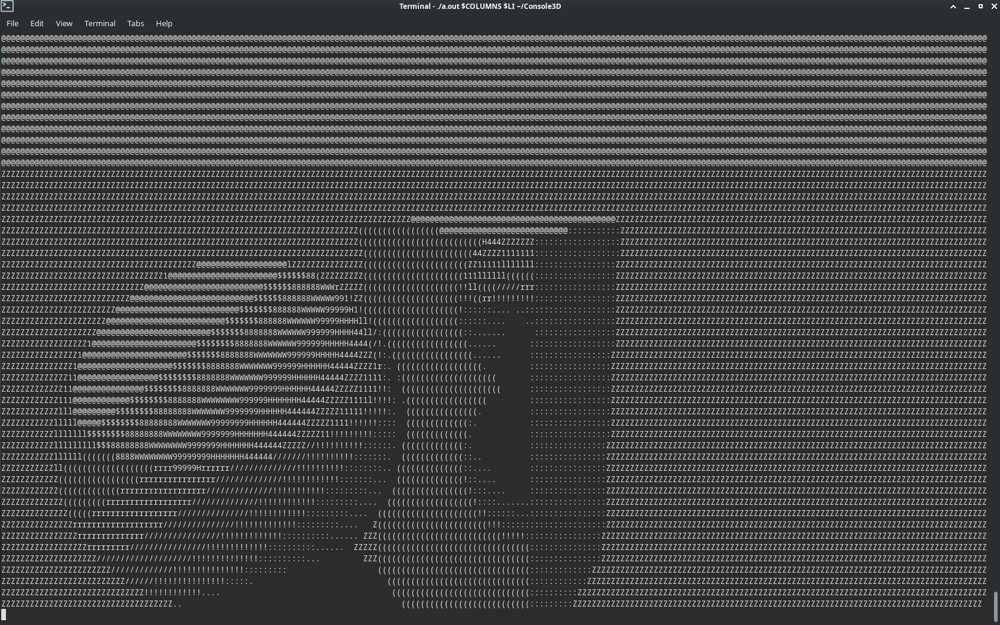

# Console3D
## Adapted for Linux
The code is already compiled for x86\_64 platform, but you can run `g++ ConsoleRayTracing.cpp` if you want to compile it for yours. There still are some problems such as blinking and vertical "desync".

### Warning: you have to manually enter the resolution of your terminal:

###

```./a.out [WIDTH] [HEIGHT]```

or use environment variables for more convenience

```./a.out $COLUMNS $LINES```



